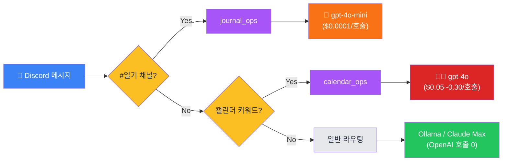

# hermes-hybrid 메시지 라우팅 흐름

Discord 메시지가 도착해서 최종 LLM이 호출되기까지 5층 게이트를 거친다.
각 게이트가 처리하면 즉시 반환 — 아래 게이트는 안 거친다.

> **시각화 방법**: 아래 Mermaid 코드 블록을 그대로 [mermaid.live](https://mermaid.live)에
> 붙여넣으면 즉시 SVG 다이어그램이 보인다. GitHub/Notion에서는 자동 렌더.

## 색상 범례

- 🔵 **파랑** — 진입점 (Discord / Cron / Watcher)
- 🟡 **노랑** — 결정 분기 (if/else)
- ⚪ **회색** — 게이트 (라우팅 단계)
- 🟢 **초록** — 무료 경로 (Ollama / Claude Max OAuth / 내장 응답)
- 🟠 **주황** — OpenAI **저렴** 경로 (gpt-4o-mini)
- 🔴 **빨강** — OpenAI **비싼** 경로 (gpt-4o)
- 🟣 **보라** — 새로 추가된 forced_profile 경로
- 🟫 **베이지** — 외부 시스템 sink (Google Sheets/Calendar 등)

## 전체 흐름

```mermaid
flowchart TD
    %% ───────── ENTRY POINTS ─────────
    subgraph entry [" "]
        A1["💬 Discord 메시지<br/>실시간"]:::entry
        A2["⏰ Cron 자동 실행<br/>현재 inactive (systemd dead)"]:::entryDead
        A3["📨 Mail Watcher<br/>5분 폴링"]:::entry
    end

    A1 --> B["discord_bot.on_message<br/>(allowlist 검사)"]
    A2 -.-> X1["(현재 비활성)"]:::dead
    A3 --> SINK_DC[("Discord 알림<br/>webhook")]:::sink

    %% ───────── GATE 0: HEAVY ─────────
    B --> G0{"!heavy<br/>접두사?"}:::decision
    G0 -- Yes --> H0["Claude Code CLI<br/>Sonnet/Opus<br/>(Max OAuth)"]:::free

    %% ───────── GATE 1: FORCED PROFILE ─────────
    G0 -- No --> G1{"채널 ID =<br/>JOURNAL_CHANNEL_ID?"}:::decision
    G1 -- Yes<br/>(#일기) --> P1["forced_profile<br/>= journal_ops"]:::forced
    P1 --> H1A["hermes -p journal_ops chat<br/>(rule/skill/factory/router 우회)"]:::forced
    H1A --> H1B["💸 OpenAI gpt-4o-mini<br/>(약 $0.0001/호출)"]:::openaiCheap
    H1B --> H1C["sheets_append skill"]:::gate
    H1C --> SINK_GS[("Google Sheets<br/>(Apps Script)")]:::sink

    %% ───────── GATE 2: RULE LAYER ─────────
    G1 -- No --> G2["Rule Layer<br/>(/ping /help /retry ...)"]:::gate
    G2 --> G2D{"정확 일치?"}:::decision
    G2D -- Yes --> H2["내장 응답<br/>(LLM 안 부름)"]:::free

    %% ───────── GATE 3: SKILL SURFACE ─────────
    G2D -- No --> G3["Skill Surface"]:::gate
    G3 --> G3D{"CalendarSkill<br/>패턴 매치?<br/>(\\\"내일\\\", \\\"일정\\\")"}:::decision
    G3D -- Yes --> H3A["hermes -p calendar_ops<br/>+ Google Calendar MCP"]:::gate
    H3A --> H3B["💸💸 OpenAI gpt-4o<br/>(plan/act/reflect<br/>호출당 수~수십 회)"]:::openaiExpensive
    H3B --> SINK_GC[("Google Calendar")]:::sink

    %% ───────── GATE 4: JOB FACTORY ─────────
    G3D -- No --> G4{"JobFactory<br/>enabled?"}:::decision
    G4 -- "No (현재)" --> G5["Router"]:::gate
    G4 -. "Yes (비활성)" .-> X2["(현재 미사용)"]:::dead

    %% ───────── GATE 5: ROUTER + TIER ─────────
    G5 --> G5D{"tier 결정"}:::decision
    G5D -- "L2/L3 (local)" --> T1["L2/L3 dispatch"]:::gate
    G5D -- "C1 (cloud)" --> T2["C1 dispatch"]:::gate

    T1 --> T1D{"OLLAMA_<br/>ENABLED?"}:::decision
    T1D -- "true (현재)" --> H_OL["Ollama qwen2.5<br/>($0)"]:::free
    T1D -- false --> H_SUR["💸 gpt-4o-mini<br/>or gpt-4o (surrogate)"]:::openaiCheap

    T2 --> T2D{"C1_BACKEND"}:::decision
    T2D -- "claude_cli (현재)" --> H_CLA["Claude Haiku CLI<br/>(Max OAuth, $0)"]:::free
    T2D -- openai --> H_GPT4["💸💸 gpt-4o"]:::openaiExpensive

    %% Validator 자동 escalation (점선)
    H_OL -. "validator 실패<br/>→ escalate" .-> T2
    H_SUR -. "validator 실패" .-> T2

    %% ───────── STYLES ─────────
    classDef entry fill:#3b82f6,color:#fff,stroke:#1e40af,stroke-width:2px
    classDef entryDead fill:#94a3b8,color:#fff,stroke:#475569,stroke-dasharray: 5 5
    classDef decision fill:#fbbf24,color:#1f2937,stroke:#d97706,stroke-width:2px
    classDef gate fill:#e5e7eb,color:#1f2937,stroke:#6b7280
    classDef free fill:#22c55e,color:#fff,stroke:#15803d,stroke-width:2px
    classDef openaiCheap fill:#f97316,color:#fff,stroke:#c2410c,stroke-width:2px
    classDef openaiExpensive fill:#dc2626,color:#fff,stroke:#7f1d1d,stroke-width:2px
    classDef forced fill:#a855f7,color:#fff,stroke:#6b21a8,stroke-width:2px
    classDef sink fill:#fef3c7,color:#1f2937,stroke:#d97706
    classDef dead fill:#cbd5e1,color:#475569,stroke:#94a3b8,stroke-dasharray: 5 5
```

---

## OpenAI 호출 경로만 강조한 단순 버전



→ 단순화하면: **OpenAI 호출은 두 분기로만 흘러감**.

---

## 게이트별 코드 위치

| 게이트 | 파일 | 함수 / 라인 |
|--------|------|------------|
| 0a heavy | `src/gateway/discord_bot.py` | `on_message:142` (`!heavy` 검사) |
| **0b forced_profile** | `src/gateway/discord_bot.py` | `on_message:138` (channel_id 검사) |
| ↳ 핸들러 | `src/orchestrator/orchestrator.py` | `_handle_forced_profile:957` |
| 1 rule | `src/router/rule_layer.py` | `RuleLayer.match` |
| 2 skill | `src/skills/calendar.py` | `CalendarSkill.match/invoke` |
| 3 factory | `src/job_factory/factory.py` | `JobFactory.decide` |
| 4 router | `src/router/router.py` | `Router.decide` |
| 5 tier | `src/orchestrator/orchestrator.py` | `_dispatch_with_retries:489`, `_run_local_tier:626`, `_run_c1:730` |
| validator | `src/validator/validator.py` | `Validator.validate` |

---

## `.env` 플래그가 흐름을 어떻게 바꾸나

| 플래그 | 현재 값 | 효과 |
|--------|---------|------|
| `JOURNAL_CHANNEL_ID` | `1498936938407661619` | #일기 메시지를 forced_profile로 → gpt-4o-mini |
| `CALENDAR_SKILL_ENABLED` | `true` | 캘린더 키워드 매치 시 → gpt-4o (**비용 주범 후보**) |
| `OLLAMA_ENABLED` | `true` | L2/L3 → Ollama, surrogate(OpenAI) 우회 |
| `C1_BACKEND` | `claude_cli` | C1 escalation → Claude Haiku Max (OpenAI 우회) |
| `JOB_FACTORY_ENABLED` | `false` | factory 라우팅 비활성 |
| `WATCHER_ENABLED` | `true` | mail_ops 5분 폴링 (LLM 호출 0) |

→ **OpenAI 호출이 발생하는 활성 경로는 두 개뿐**: forced_profile(`#일기` → gpt-4o-mini) + skill(캘린더 → gpt-4o).
